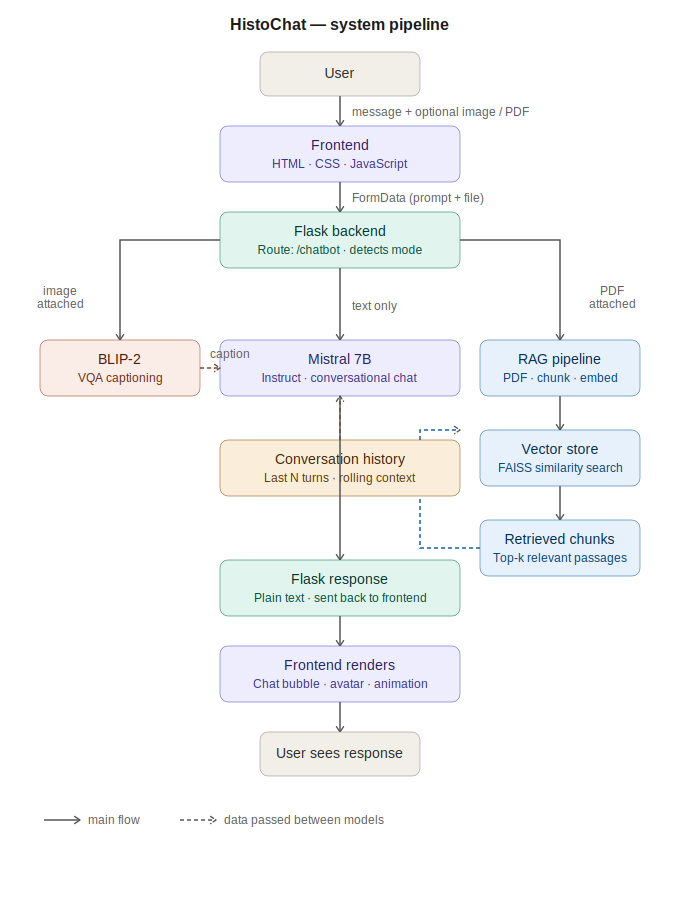

# HistoChat 🔬

**A medical AI chatbot assistant being built toward specialization in histopathology.**

Currently supports conversational chat, image understanding via vision models, and a document Q&A pipeline (RAG).  
The project is designed so that general-purpose models can be swapped for domain-specialized ones as the pipeline matures.

---

# Features

**Conversational chat** — powered by **Mistral 7B Instruct** with rolling conversation history  

**Image understanding** — upload an image and ask questions about it using **BLIP-2 VQA**, with **Mistral delivering the final conversational response**  

**Document Q&A (RAG)** — upload a PDF and ask questions about its content using a **retrieval-augmented generation pipeline (in progress)**

---

# Tech Stack

### Frontend
**HTML, CSS, JavaScript**

### Backend
**Python, Flask, Flask-CORS**

### Chat model
**Mistral 7B Instruct** *(mistralai/Mistral-7B-Instruct-v0.1)*

### Vision model
**BLIP-2 OPT 6.7B** *(Salesforce/blip2-opt-6.7b)*

### RAG
**FAISS + sentence-transformers (in progress)**

### ML framework
**PyTorch, HuggingFace Transformers, Accelerate**

